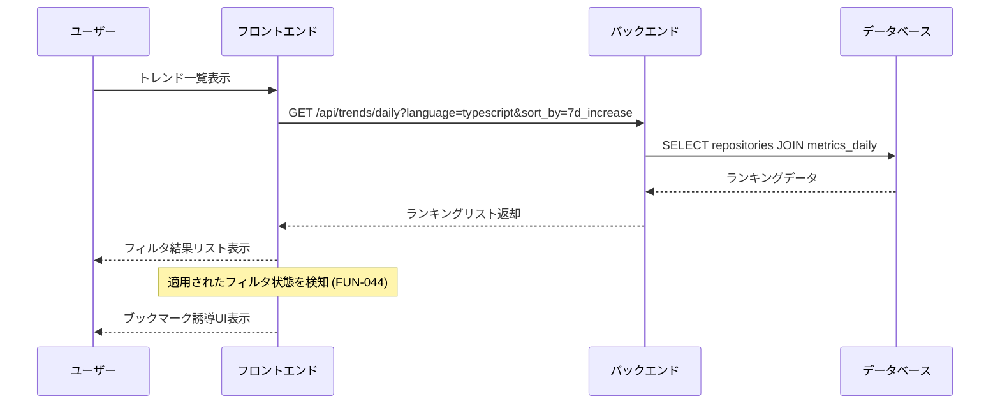
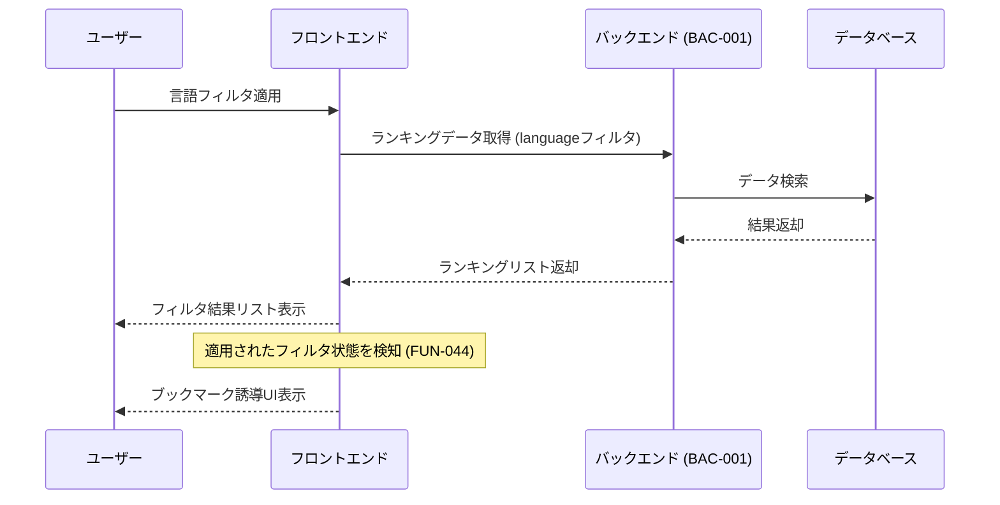
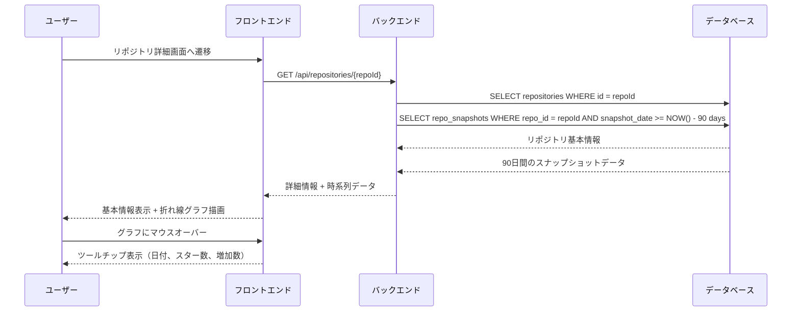
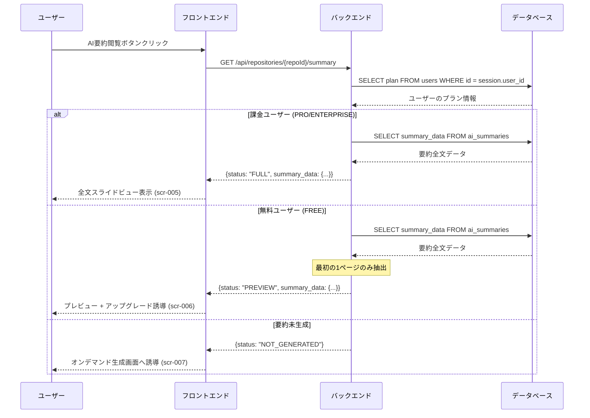
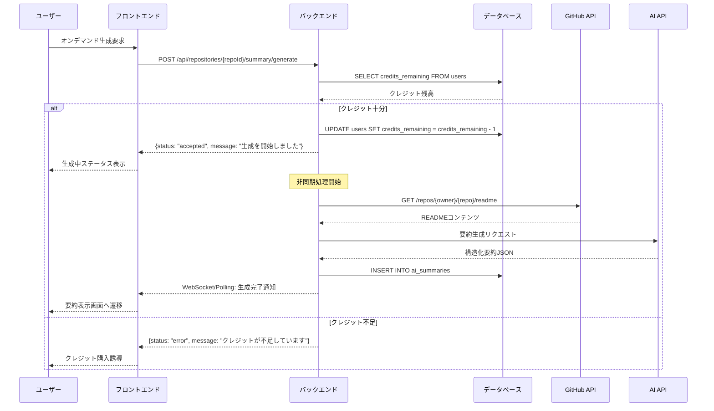
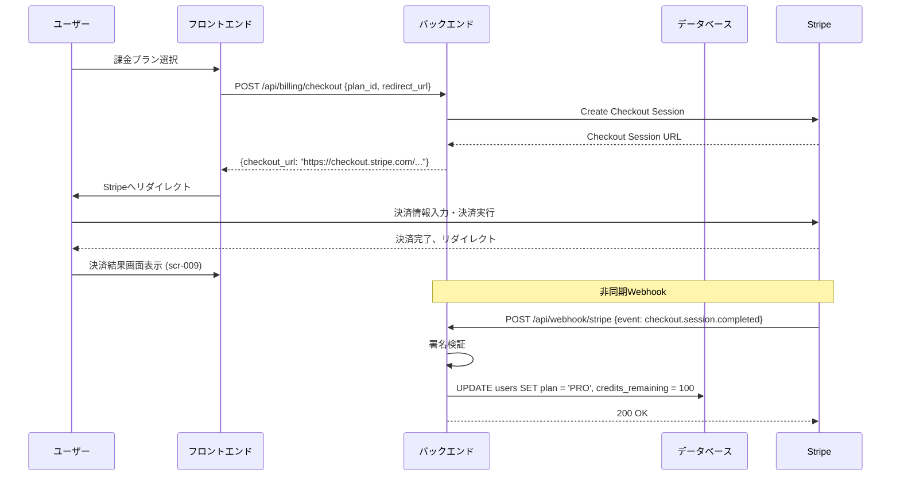
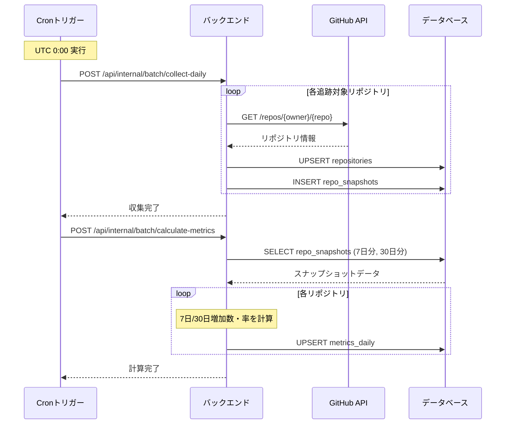

# シーケンス図

主要処理のシーケンスを示す。

## トレンド一覧表示フロー

```mermaid
sequenceDiagram
    participant User as ユーザー
    participant FE as フロントエンド
    participant BE as バックエンド
    participant DB as データベース

    User->>FE: トレンド一覧表示
    FE->>BE: GET /api/trends/daily?language=typescript&sort_by=7d_increase
    BE->>DB: SELECT repositories JOIN metrics_daily
    DB-->>BE: ランキングデータ
    BE-->>FE: ランキングリスト返却
    FE-->>User: フィルタ結果リスト表示

    Note over FE: 適用されたフィルタ状態を検知 (FUN-044)
    FE-->>User: ブックマーク誘導UI表示
```

## 言語フィルタリングフロー

```mermaid
sequenceDiagram
    participant User as ユーザー
    participant FE as フロントエンド
    participant BE as バックエンド (BAC-001)
    participant DB as データベース

    User->>FE: 言語フィルタ適用
    FE->>BE: ランキングデータ取得 (languageフィルタ)
    BE->>DB: データ検索
    DB-->>BE: 結果返却
    BE-->>FE: ランキングリスト返却
    FE-->>User: フィルタ結果リスト表示

    Note over FE: 適用されたフィルタ状態を検知 (FUN-044)
    FE-->>User: ブックマーク誘導UI表示
```

## リポジトリ詳細・グラフ表示フロー

```mermaid
sequenceDiagram
    participant User as ユーザー
    participant FE as フロントエンド
    participant BE as バックエンド
    participant DB as データベース

    User->>FE: リポジトリ詳細画面へ遷移
    FE->>BE: GET /api/repositories/{repoId}
    BE->>DB: SELECT repositories WHERE id = repoId
    BE->>DB: SELECT repo_snapshots WHERE repo_id = repoId AND snapshot_date >= NOW() - 90 days
    DB-->>BE: リポジトリ基本情報
    DB-->>BE: 90日間のスナップショットデータ
    BE-->>FE: 詳細情報 + 時系列データ
    FE-->>User: 基本情報表示 + 折れ線グラフ描画

    User->>FE: グラフにマウスオーバー
    FE-->>User: ツールチップ表示（日付、スター数、増加数）
```

## AI要約閲覧フロー（課金チェック込み）

```mermaid
sequenceDiagram
    participant User as ユーザー
    participant FE as フロントエンド
    participant BE as バックエンド
    participant DB as データベース

    User->>FE: AI要約閲覧ボタンクリック
    FE->>BE: GET /api/repositories/{repoId}/summary

    BE->>DB: SELECT plan FROM users WHERE id = session.user_id
    DB-->>BE: ユーザーのプラン情報

    alt 課金ユーザー (PRO/ENTERPRISE)
        BE->>DB: SELECT summary_data FROM ai_summaries
        DB-->>BE: 要約全文データ
        BE-->>FE: {status: "FULL", summary_data: {...}}
        FE-->>User: 全文スライドビュー表示 (scr-005)
    else 無料ユーザー (FREE)
        BE->>DB: SELECT summary_data FROM ai_summaries
        DB-->>BE: 要約全文データ
        Note over BE: 最初の1ページのみ抽出
        BE-->>FE: {status: "PREVIEW", summary_data: {...}}
        FE-->>User: プレビュー + アップグレード誘導 (scr-006)
    else 要約未生成
        BE-->>FE: {status: "NOT_GENERATED"}
        FE-->>User: オンデマンド生成画面へ誘導 (scr-007)
    end
```

## オンデマンドAI要約生成フロー

```mermaid
sequenceDiagram
    participant User as ユーザー
    participant FE as フロントエンド
    participant BE as バックエンド
    participant DB as データベース
    participant GitHub as GitHub API
    participant AI as AI API

    User->>FE: オンデマンド生成要求
    FE->>BE: POST /api/repositories/{repoId}/summary/generate

    BE->>DB: SELECT credits_remaining FROM users
    DB-->>BE: クレジット残高

    alt クレジット十分
        BE->>DB: UPDATE users SET credits_remaining = credits_remaining - 1
        BE-->>FE: {status: "accepted", message: "生成を開始しました"}
        FE-->>User: 生成中ステータス表示

        Note over BE: 非同期処理開始
        BE->>GitHub: GET /repos/{owner}/{repo}/readme
        GitHub-->>BE: READMEコンテンツ
        BE->>AI: 要約生成リクエスト
        AI-->>BE: 構造化要約JSON
        BE->>DB: INSERT INTO ai_summaries

        BE-->>FE: WebSocket/Polling: 生成完了通知
        FE-->>User: 要約表示画面へ遷移
    else クレジット不足
        BE-->>FE: {status: "error", message: "クレジットが不足しています"}
        FE-->>User: クレジット購入誘導
    end
```

## Stripe決済フロー

```mermaid
sequenceDiagram
    participant User as ユーザー
    participant FE as フロントエンド
    participant BE as バックエンド
    participant DB as データベース
    participant Stripe as Stripe

    User->>FE: 課金プラン選択
    FE->>BE: POST /api/billing/checkout {plan_id, redirect_url}
    BE->>Stripe: Create Checkout Session
    Stripe-->>BE: Checkout Session URL
    BE-->>FE: {checkout_url: "https://checkout.stripe.com/..."}
    FE->>User: Stripeへリダイレクト

    User->>Stripe: 決済情報入力・決済実行
    Stripe-->>User: 決済完了、リダイレクト
    User->>FE: 決済結果画面表示 (scr-009)

    Note over Stripe,BE: 非同期Webhook
    Stripe->>BE: POST /api/webhook/stripe {event: checkout.session.completed}
    BE->>BE: 署名検証
    BE->>DB: UPDATE users SET plan = 'PRO', credits_remaining = 100
    BE-->>Stripe: 200 OK
```

## 日次バッチ処理フロー

```mermaid
sequenceDiagram
    participant Cron as Cronトリガー
    participant BE as バックエンド
    participant GitHub as GitHub API
    participant DB as データベース

    Note over Cron: UTC 0:00 実行

    Cron->>BE: POST /api/internal/batch/collect-daily

    loop 各追跡対象リポジトリ
        BE->>GitHub: GET /repos/{owner}/{repo}
        GitHub-->>BE: リポジトリ情報
        BE->>DB: UPSERT repositories
        BE->>DB: INSERT repo_snapshots
    end

    BE-->>Cron: 収集完了

    Cron->>BE: POST /api/internal/batch/calculate-metrics

    BE->>DB: SELECT repo_snapshots (7日分, 30日分)
    DB-->>BE: スナップショットデータ

    loop 各リポジトリ
        Note over BE: 7日/30日増加数・率を計算
        BE->>DB: UPSERT metrics_daily
    end

    BE-->>Cron: 計算完了
```
