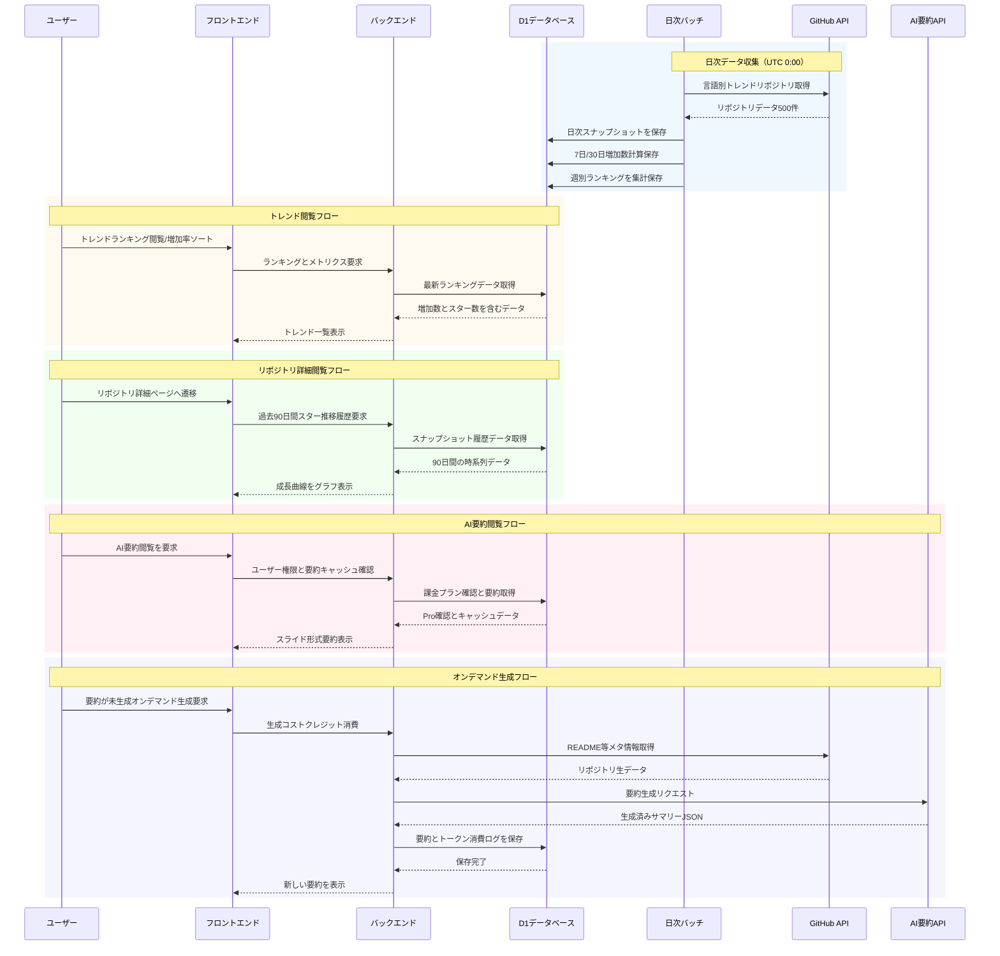

# システム化業務フロー

本システムにおける主要業務フローを示す。

## 全体フロー

## フロー説明

### 1. 日次データ収集（バッチ処理）

| ステップ | 処理内容 |
|---------|---------|
| 1 | GitHub APIから言語別トレンドリポジトリを取得（最大500件） |
| 2 | スナップショットデータ（スター数、フォーク数等）をDBに保存 |
| 3 | 7日間/30日間のスター増加数を計算・保存 |
| 4 | 週別ランキングを集計・保存 |

### 2. トレンド閲覧フロー

| ステップ | 処理内容 |
|---------|---------|
| 1 | ユーザーがトップページにアクセス |
| 2 | フロントエンドがAPIにランキングデータを要求 |
| 3 | バックエンドがDBから最新ランキングを取得 |
| 4 | 増加数・スター数を含むデータを返却 |
| 5 | フロントエンドが一覧を表示 |

### 3. リポジトリ詳細閲覧フロー

| ステップ | 処理内容 |
|---------|---------|
| 1 | ユーザーがリポジトリ詳細ページへ遷移 |
| 2 | 過去90日間のスナップショット履歴を要求 |
| 3 | DBから時系列データを取得 |
| 4 | 折れ線グラフとして成長曲線を表示 |

### 4. AI要約閲覧フロー（課金ユーザー）

| ステップ | 処理内容 |
|---------|---------|
| 1 | ユーザーがAI要約閲覧を要求 |
| 2 | ユーザーの課金プランを確認 |
| 3 | キャッシュ済み要約があれば取得 |
| 4 | スライド形式で要約を表示 |

### 5. オンデマンド生成フロー

| ステップ | 処理内容 |
|---------|---------|
| 1 | ユーザーが未生成リポジトリの要約生成を要求 |
| 2 | クレジット残高を確認・消費 |
| 3 | GitHub APIからREADME等のメタ情報を取得 |
| 4 | AI APIで構造化要約を生成 |
| 5 | 生成結果をDBに保存 |
| 6 | ユーザーに新しい要約を表示 |
