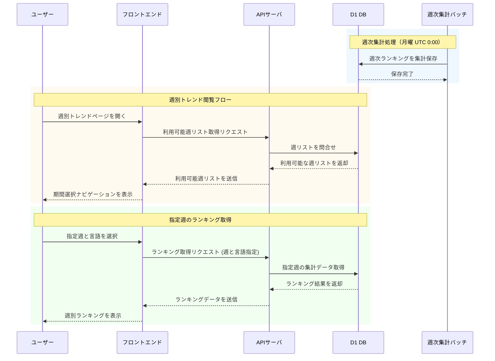

# 週別トレンド業務フロー

週別トレンドランキング機能の業務フローを示す。

## シーケンス図

## フロー説明

### 1. 週次集計バッチ処理

| ステップ | 処理内容 | タイミング |
|---------|---------|-----------|
| 1 | 過去7日間のスナップショットから週間スター増加数を計算 | 月曜 UTC 0:00 |
| 2 | 言語別にトップ10ランキングを算出 | |
| 3 | 週番号・年と関連付けてDBに保存 | |

### 2. 週別トレンドページ表示

| ステップ | 処理内容 |
|---------|---------|
| 1 | ユーザーが週別トレンドページにアクセス |
| 2 | APIから利用可能な週リストを取得 |
| 3 | 期間選択ナビゲーション（ドロップダウン/カレンダー）を表示 |
| 4 | デフォルトで最新週のランキングを表示 |

### 3. 指定週のランキング取得

| ステップ | 処理内容 |
|---------|---------|
| 1 | ユーザーが特定の週と言語を選択 |
| 2 | APIにランキング取得リクエストを送信 |
| 3 | DBから該当週・言語の集計データを取得 |
| 4 | トップ10ランキングを表示 |

## データモデル

### weekly_rankings テーブル（予定）

| カラム | 型 | 説明 |
|--------|-----|------|
| id | INTEGER | 主キー |
| year | INTEGER | 年（例: 2024） |
| week_number | INTEGER | ISO週番号（1-53） |
| language | TEXT | 言語（NULL=全言語） |
| repo_id | INTEGER | リポジトリID（FK） |
| rank | INTEGER | ランキング順位（1-10） |
| stars_gained | INTEGER | 週間スター増加数 |
| created_at | TEXT | 作成日時 |

### 制約

- `(year, week_number, language, rank)` にUNIQUE制約
- 各週・各言語でトップ10のみ保存
