# 環境設計

## 総括

| 観点 | 評価 | 補足 |
| --- | --- | --- |
| 構成思想 | ✅ 適切 | シンプル・サーバーレス・低運用コスト |
| 技術選定 | ✅ 妥当 | Cloudflare統一は合理的 |
| 運用・障害・データ管理 | ⚠️ 要対応 | 「壊れたときにどうするか」の設計が必要 |

**設計原則:**
- API契約は後方互換を原則とし、破壊的変更はマイグレーション・デプロイ前に検知する
- 障害時は障害種別ごとの初動表に従い、復旧手段はバックアップ復旧を含めて定期検証する
- シークレットはローテーション手順を持ち、監視は通知閾値と個人情報マスキングを明文化する

---

## 環境構成

2環境構成（development / production）を採用。staging は作らず、Cloudflare Pages の PR Preview を代替として活用する。

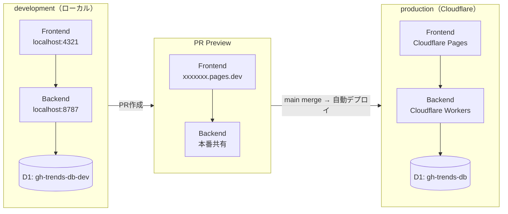

> PR Preview はフロント確認専用。APIの後方互換性・DBスキーマ変更の影響は検証できないため、後述の「API互換性ルール」と統合テストで担保する。

---

## CI/CDパイプライン

main への push で **Backend → Frontend の順に直列デプロイ**する。DBマイグレーション失敗時は後続ジョブを確実に打ち切る。

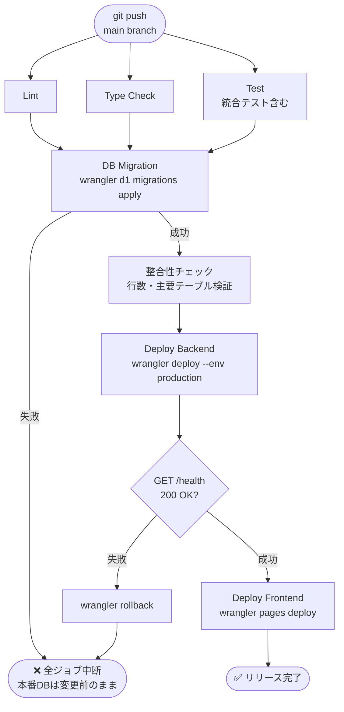

---

## デプロイシーケンス

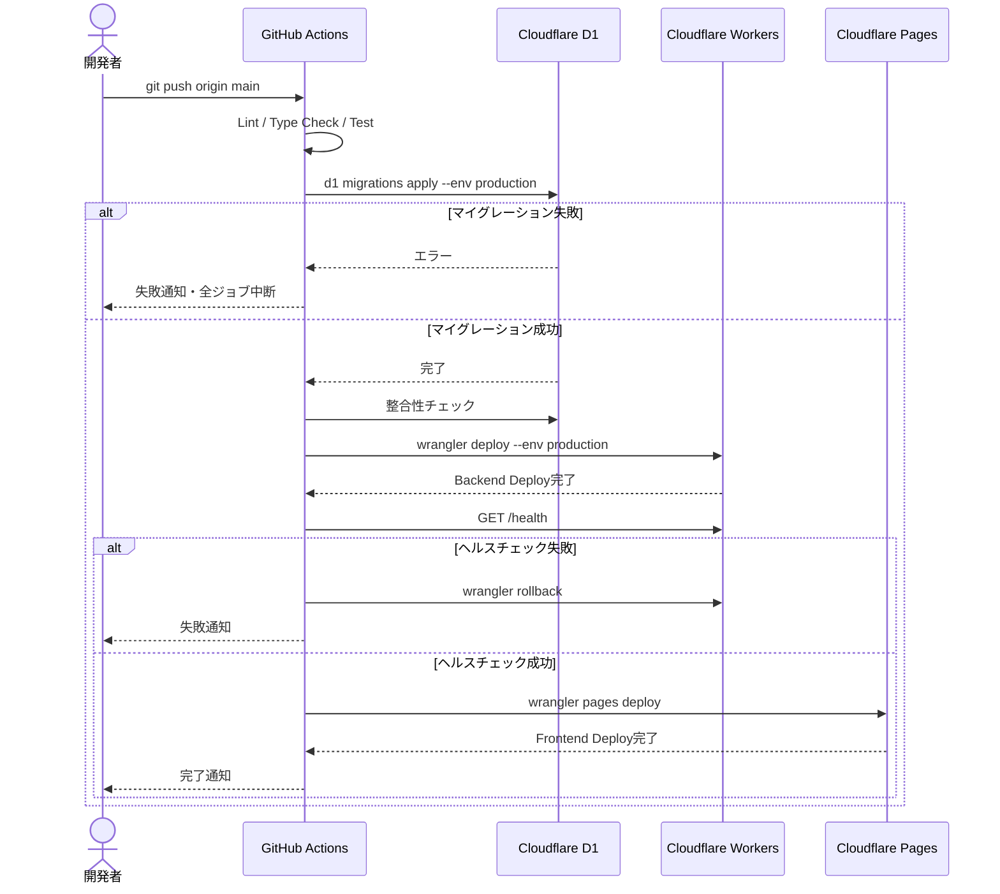

---

## API互換性ルール

PR Preview では API の破壊的変更を検知できないため、ルールとして明文化する。

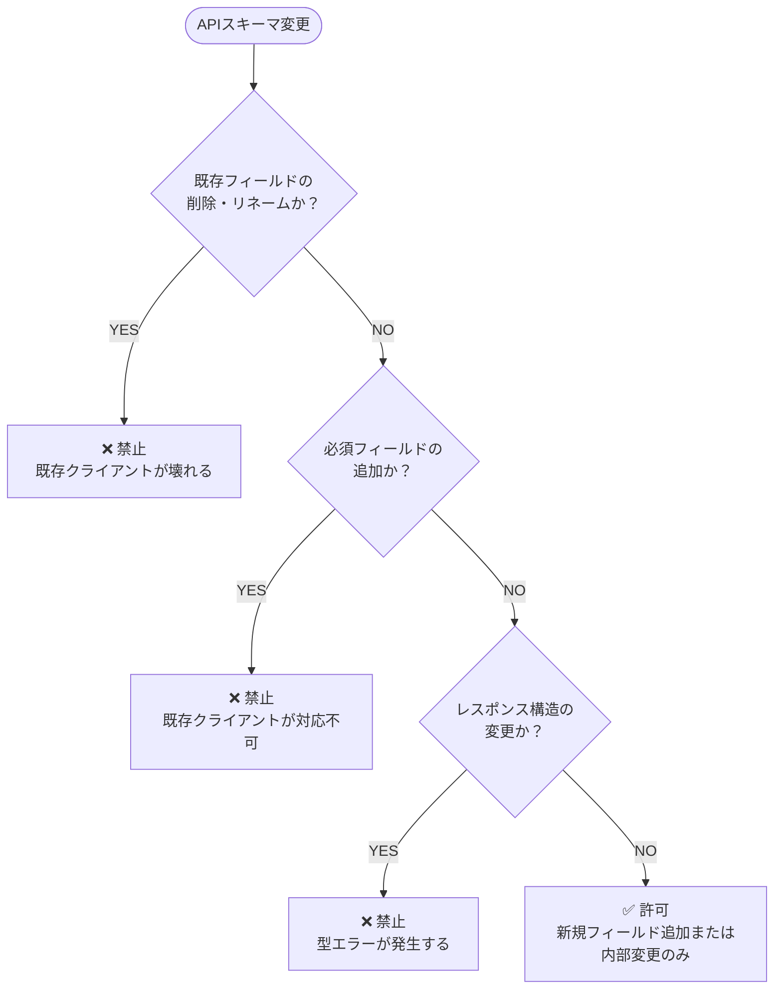

| 変更種別 | 可否 | 理由 |
| --- | --- | --- |
| 新規フィールド追加（optional） | ✅ 可 | 既存クライアントは無視できる |
| 既存フィールド削除 | ❌ 禁止 | 既存クライアントが壊れる |
| フィールドのリネーム | ❌ 禁止 | 削除＋追加と同等 |
| 必須フィールドの追加 | ❌ 禁止 | 既存クライアントが対応不可 |
| レスポンス構造の変更 | ❌ 禁止 | 型エラーが発生する |
| エンドポイントの削除 | ❌ 禁止 | 非推奨期間を設けてから削除 |

---

## DBマイグレーション管理

スキーマ変更は `schema.sql` の直接編集ではなく、**差分マイグレーションファイルで管理**する。

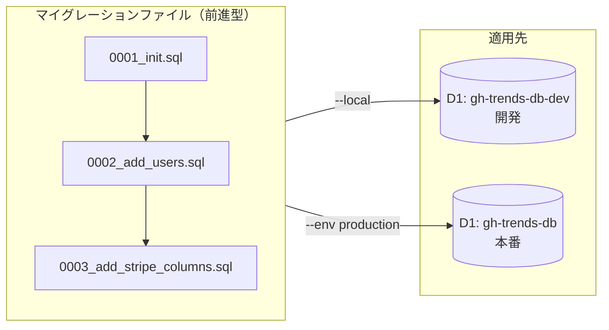

| ルール | 詳細 |
| --- | --- |
| `schema.sql` 直接編集禁止 | 必ずマイグレーションファイルを追加する |
| 前進型ロールバック | UNDO より次のマイグレーションで修正 |
| 復旧切り替え基準 | 整合性エラー発生時、または前進型修正に30分以上かかる見込みの場合はR2バックアップ復旧へ切り替える |
| `schema.ts` との同期 | Drizzle ORM の `schema.ts` と `schema.sql` は常に同期必須 |

---

## バックアップ戦略

D1 Time Travel と R2 エクスポートを役割分担して多層防御する。

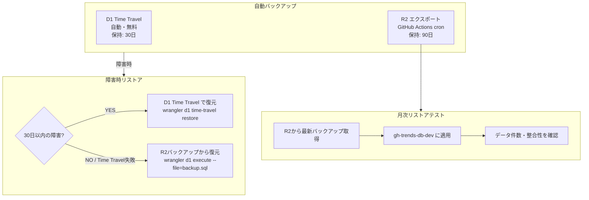

| 手段 | 保持期間 | 用途 |
| --- | --- | --- |
| D1 Time Travel | 30日 | 直近の誤操作・軽微なデータ破損の高速復旧 |
| R2 エクスポート | 90日 | Time Travel 範囲外・大規模障害時の復旧 |

---

## 環境変数管理

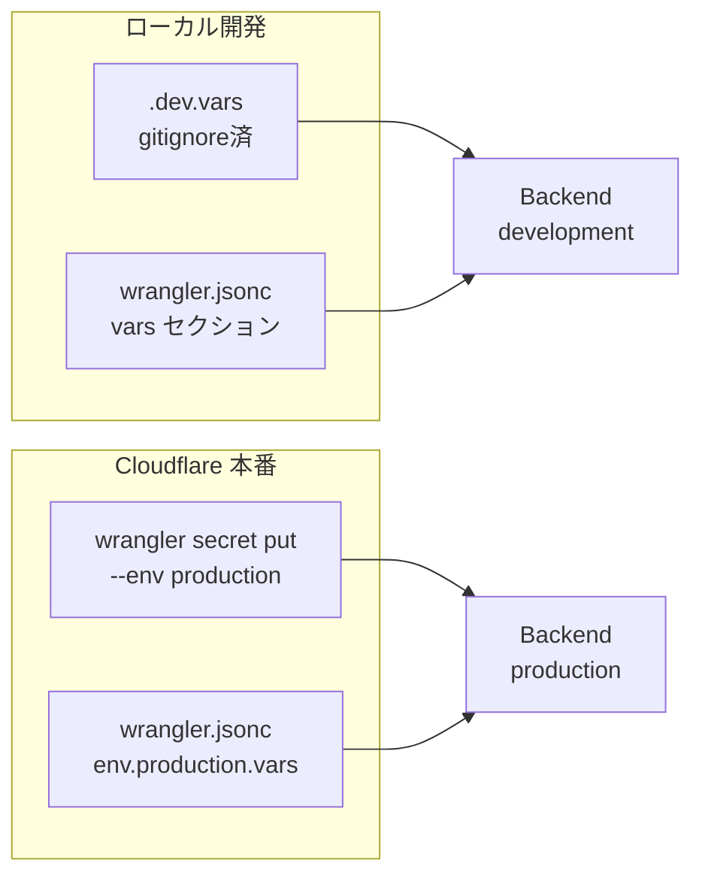

| 変数名 | 開発 | 本番 | ローテーション頻度 |
| --- | --- | --- | --- |
| `ENVIRONMENT` | `wrangler.jsonc` vars | `wrangler.jsonc` env.production vars | 不要 |
| `ALLOWED_ORIGINS` | 不要（`*` 適用） | `wrangler secret put` | ドメイン変更時 |
| `GITHUB_TOKEN` | `.dev.vars` | `wrangler secret put` | 年1回または漏洩時 |
| `INTERNAL_API_TOKEN` | `.dev.vars` | `wrangler secret put` | 年1回または漏洩時 |
| `SENTRY_DSN`（Backend） | `.dev.vars`（省略可） | `wrangler secret put` | Sentry DSN変更時 |
| `JWT_SECRET`（Phase 3） | `.dev.vars` | `wrangler secret put` | 年1回または漏洩時 |
| `STRIPE_SECRET_KEY`（Phase 3） | `.dev.vars` | `wrangler secret put` | Stripe推奨に従う |
| `PUBLIC_SENTRY_DSN`（Frontend） | `.env.local`（省略可） | CI/CD環境変数 | Sentry DSN変更時 |

**ローテーション手順:**
1. `wrangler secret put <KEY> --env production` で新しい値を設定
2. Workers は次のリクエストから新しい値を使用（再デプロイ不要）
3. ローテーション後は旧トークンを発行元（GitHub / Stripe）から無効化

---

## 監視・ログ設計

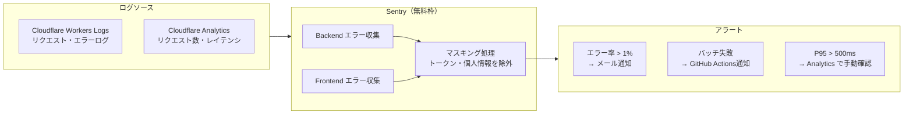

| 対象データ | マスキング処理 |
| --- | --- |
| `Authorization` ヘッダー | ログ出力しない |
| `GITHUB_TOKEN` / `INTERNAL_API_TOKEN` | 環境変数のみ保持、ログ不出力 |
| メールアドレス（Phase 3） | `***@***.***` にマスク |
| Stripe 顧客ID（Phase 3） | `cus_***` で末尾のみ記録 |

---

## 障害対応フロー

**初動基準: 検知から15分以内に障害種別を特定し、復旧手段を選択する。**

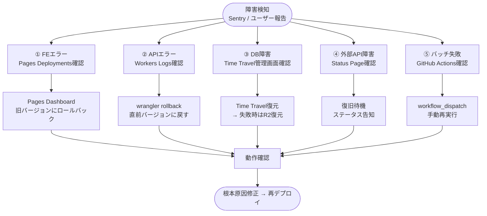

| 障害種別 | 最初に見る場所 | 復旧手段 | 目標復旧時間 |
| --- | --- | --- | --- |
| FEエラー | Sentry → Pages Deployments | Pages ロールバック | 10分 |
| APIエラー（5xx） | Workers Logs | wrangler rollback | 15分 |
| DB障害 | D1 Time Travel 管理画面 | Time Travel → R2復元 | 30分 |
| 外部API障害 | GitHub / Stripe Status Page | 復旧待機 | 外部依存 |
| バッチ失敗 | GitHub Actions ログ | workflow_dispatch で再実行 | 30分 |

---

## セキュリティ設計

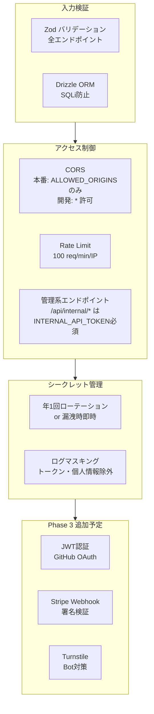

---

## 実装ロードマップ

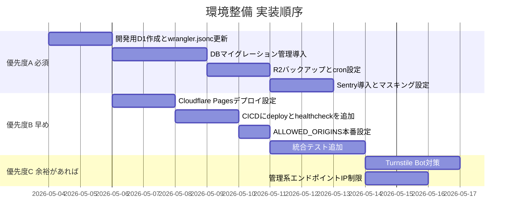
