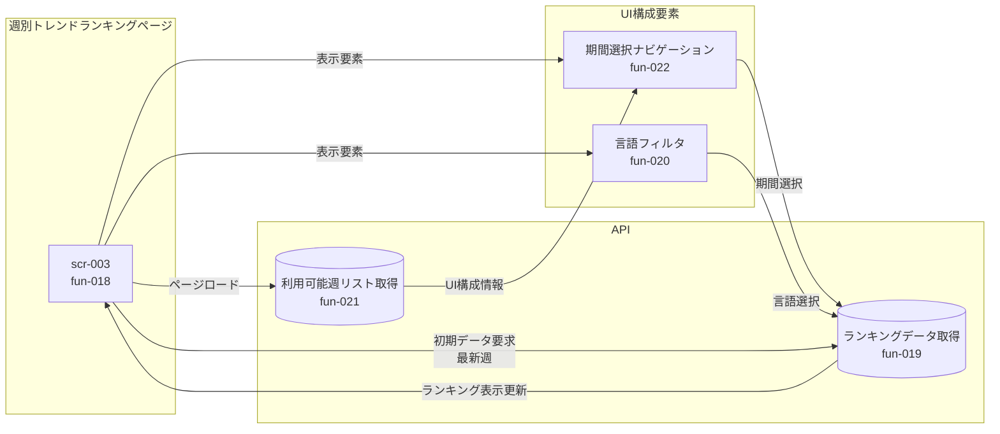

# 画面遷移図

画面間の遷移フローを示す。

## 全体遷移図

```mermaid
flowchart TB
    subgraph 閲覧系
        scr001[scr-001<br/>トレンド一覧画面]
        scr002[scr-002<br/>リポジトリ詳細画面]
        scr003[scr-003<br/>週別トレンド画面]
        scr004[scr-004<br/>検索結果一覧]
        scr010[scr-010<br/>お気に入り一覧]
    end

    subgraph AI機能
        scr005[scr-005<br/>AI要約全文]
        scr006[scr-006<br/>AI要約プレビュー]
        scr007[scr-007<br/>オンデマンド生成]
    end

    subgraph 認証・課金
        scr008[scr-008<br/>課金プラン選択]
        scr009[scr-009<br/>決済結果]
        scr011[scr-011<br/>ログイン]
    end

    subgraph 外部
        github[GitHub OAuth]
        stripe[Stripe Checkout]
    end

    %% 閲覧系の遷移
    scr001 -->|リポジトリ選択| scr002
    scr001 -->|検索実行| scr004
    scr001 -->|週別タブ| scr003
    scr001 -->|お気に入り| scr010

    scr003 -->|リポジトリ選択| scr002
    scr004 -->|リポジトリ選択| scr002
    scr010 -->|リポジトリ選択| scr002

    %% 詳細からAI機能への遷移
    scr002 -->|AI要約閲覧<br/>課金ユーザー| scr005
    scr002 -->|AI要約閲覧<br/>無料ユーザー| scr006
    scr002 -->|オンデマンド生成| scr007

    %% AI機能から課金への遷移
    scr006 -->|アップグレード| scr008
    scr007 -->|クレジット購入| scr008

    %% 認証・課金フロー
    scr011 -->|GitHub OAuth| github
    github -->|コールバック| scr001

    scr008 -->|決済開始| stripe
    stripe -->|決済完了| scr009
    scr009 -->|戻る| scr001

    %% ヘッダーからのグローバル遷移（点線）
    scr001 -.->|ログイン| scr011
    scr002 -.->|ログイン| scr011
```

## 画面遷移一覧

| 遷移元  | 遷移先  | トリガー               | 条件             |
| ------- | ------- | ---------------------- | ---------------- |
| scr-001 | scr-002 | リポジトリクリック     | -                |
| scr-001 | scr-003 | 週別タブ/リンク        | -                |
| scr-001 | scr-004 | 検索実行               | -                |
| scr-001 | scr-010 | お気に入りリンク       | -                |
| scr-001 | scr-011 | ログインボタン         | 未認証時         |
| scr-002 | scr-005 | AI要約閲覧ボタン       | 課金ユーザー     |
| scr-002 | scr-006 | AI要約閲覧ボタン       | 無料ユーザー     |
| scr-002 | scr-007 | オンデマンド生成ボタン | 課金ユーザー     |
| scr-003 | scr-002 | リポジトリクリック     | -                |
| scr-004 | scr-002 | リポジトリクリック     | -                |
| scr-006 | scr-008 | アップグレードボタン   | -                |
| scr-007 | scr-008 | クレジット購入リンク   | クレジット不足時 |
| scr-008 | Stripe  | 決済開始ボタン         | -                |
| scr-009 | scr-001 | 戻るボタン             | -                |
| scr-010 | scr-002 | リポジトリクリック     | -                |
| scr-011 | GitHub  | ログインボタン         | -                |
| GitHub  | scr-001 | OAuthコールバック      | 認証成功         |
| Stripe  | scr-009 | 決済完了               | -                |

## 週別トレンド画面のデータフロー


